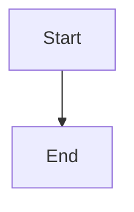

# mdthing Markdown Viewer Implementation Plan

> **For agentic workers:** REQUIRED SUB-SKILL: Use superpowers:subagent-driven-development (recommended) or superpowers:executing-plans to implement this plan task-by-task. Steps use checkbox (`- [ ]`) syntax for tracking.

**Goal:** A Go CLI (`mdthing file.md`) that opens a native window rendering a Markdown file with inline Mermaid, followable links, and live reload on save.

**Architecture:** A local HTTP server renders Markdown to HTML on demand; a webview window browses it on `127.0.0.1:<random-port>`. Link navigation and back/forward come free from the webview browsing real URLs. An fsnotify watcher on the current file's directory broadcasts a reload over Server-Sent Events when the displayed file changes.

**Tech Stack:** Go, `goldmark` (GFM), `chroma/v2` (syntax highlighting via a custom code-block renderer), `fsnotify`, `webview_go`, Mermaid JS vendored via `go:embed`.

## Global Constraints

- Go 1.22 or newer.
- Works fully offline — no runtime network access, no CDN. Mermaid is vendored.
- HTTP server binds `127.0.0.1` only, on an OS-assigned free port.
- View-only. No editing, no config file, no themes, no file-tree sidebar.
- Targets macOS (system WKWebView) and Linux (WebKitGTK).
- Module path: `github.com/dgunther/mdthing`.

> **Note vs. spec:** the spec named `goldmark-highlighting` for code blocks. This plan instead uses one custom goldmark code-block renderer that routes `mermaid` fences to `<pre class="mermaid">` and all other fences through `chroma/v2/quick`. This is fewer dependencies and gives exact control over the mermaid passthrough — same outcome, cleaner seam.

---

### Task 1: Module init and Markdown body rendering

**Files:**
- Create: `go.mod` (via `go mod init`)
- Create: `render.go`
- Test: `render_test.go`

**Interfaces:**
- Consumes: nothing.
- Produces:
  - `func RenderBody(src []byte) ([]byte, error)` — Markdown → HTML fragment (no `<html>` wrapper).
  - `func codeText(n ast.Node, src []byte) []byte` — internal helper, extracts a code block's literal text.

- [ ] **Step 1: Initialize the module and add dependencies**

Run from the repo root:

```bash
go mod init github.com/dgunther/mdthing
go get github.com/yuin/goldmark@latest
go get github.com/alecthomas/chroma/v2@latest
```

- [ ] **Step 2: Write the failing test**

Create `render_test.go`:

```go
package main

import (
	"strings"
	"testing"
)

func TestRenderBodyGFMTable(t *testing.T) {
	out, err := RenderBody([]byte("| a | b |\n|---|---|\n| 1 | 2 |\n"))
	if err != nil {
		t.Fatal(err)
	}
	if !strings.Contains(string(out), "<table") {
		t.Fatalf("expected a table, got: %s", out)
	}
}

func TestRenderBodyMermaidPassthrough(t *testing.T) {
	src := "```mermaid\ngraph TD\nA-->B\n```\n"
	out, err := RenderBody([]byte(src))
	if err != nil {
		t.Fatal(err)
	}
	s := string(out)
	if !strings.Contains(s, `<pre class="mermaid">`) {
		t.Fatalf("expected mermaid pre, got: %s", s)
	}
	if !strings.Contains(s, "graph TD") {
		t.Fatalf("expected diagram source preserved, got: %s", s)
	}
	// arrows must be HTML-escaped so the DOM textContent is the raw source
	if !strings.Contains(s, "A--&gt;B") {
		t.Fatalf("expected escaped arrows, got: %s", s)
	}
}

func TestRenderBodyCodeHighlight(t *testing.T) {
	src := "```go\nfmt.Println(1)\n```\n"
	out, err := RenderBody([]byte(src))
	if err != nil {
		t.Fatal(err)
	}
	if !strings.Contains(string(out), "Println") {
		t.Fatalf("expected code content, got: %s", out)
	}
}
```

- [ ] **Step 3: Run the test to verify it fails**

Run: `go test ./... -run TestRenderBody`
Expected: FAIL — `undefined: RenderBody`.

- [ ] **Step 4: Implement `render.go`**

```go
package main

import (
	"bytes"
	"html/template"

	"github.com/alecthomas/chroma/v2/quick"
	"github.com/yuin/goldmark"
	"github.com/yuin/goldmark/ast"
	"github.com/yuin/goldmark/extension"
	"github.com/yuin/goldmark/renderer"
	"github.com/yuin/goldmark/util"
)

var md = goldmark.New(
	goldmark.WithExtensions(extension.GFM),
	goldmark.WithRendererOptions(
		renderer.WithNodeRenderers(util.Prioritized(&codeRenderer{}, 100)),
	),
)

// RenderBody converts Markdown to an HTML fragment.
func RenderBody(src []byte) ([]byte, error) {
	var buf bytes.Buffer
	if err := md.Convert(rewriteWikilinks(src), &buf); err != nil {
		return nil, err
	}
	return buf.Bytes(), nil
}

// codeRenderer routes ```mermaid fences to a raw <pre class="mermaid"> and
// every other fence through chroma syntax highlighting.
type codeRenderer struct{}

func (r *codeRenderer) RegisterFuncs(reg renderer.NodeRendererFuncRegisterer) {
	reg.Register(ast.KindFencedCodeBlock, r.renderFenced)
	reg.Register(ast.KindCodeBlock, r.renderIndented)
}

func (r *codeRenderer) renderFenced(w util.BufWriter, source []byte, node ast.Node, entering bool) (ast.WalkStatus, error) {
	if !entering {
		return ast.WalkContinue, nil
	}
	n := node.(*ast.FencedCodeBlock)
	lang := string(n.Language(source))
	code := codeText(node, source)
	if lang == "mermaid" {
		w.WriteString(`<pre class="mermaid">`)
		template.HTMLEscape(w, code)
		w.WriteString("</pre>\n")
		return ast.WalkSkipChildren, nil
	}
	var buf bytes.Buffer
	if err := quick.Highlight(&buf, string(code), lang, "html", "github"); err != nil {
		w.WriteString("<pre><code>")
		template.HTMLEscape(w, code)
		w.WriteString("</code></pre>\n")
	} else {
		w.Write(buf.Bytes())
	}
	return ast.WalkSkipChildren, nil
}

func (r *codeRenderer) renderIndented(w util.BufWriter, source []byte, node ast.Node, entering bool) (ast.WalkStatus, error) {
	if !entering {
		return ast.WalkContinue, nil
	}
	w.WriteString("<pre><code>")
	template.HTMLEscape(w, codeText(node, source))
	w.WriteString("</code></pre>\n")
	return ast.WalkSkipChildren, nil
}

func codeText(n ast.Node, src []byte) []byte {
	var b bytes.Buffer
	lines := n.Lines()
	for i := 0; i < lines.Len(); i++ {
		s := lines.At(i)
		b.Write(s.Value(src))
	}
	return b.Bytes()
}
```

`rewriteWikilinks` is added in Task 2. For now, add a temporary passthrough at the bottom of `render.go` so this task compiles and its tests pass:

```go
// replaced by the real implementation in Task 2
func rewriteWikilinks(src []byte) []byte { return src }
```

- [ ] **Step 5: Run the tests to verify they pass**

Run: `go test ./... -run TestRenderBody`
Expected: PASS (all three).

- [ ] **Step 6: Commit**

```bash
git add go.mod go.sum render.go render_test.go
git commit -m "Add Markdown body rendering with mermaid and code highlighting"
```

---

### Task 2: Wikilink rewriting

**Files:**
- Modify: `render.go` (replace the temporary `rewriteWikilinks`)
- Test: `render_test.go`

**Interfaces:**
- Consumes: called by `RenderBody`.
- Produces: `func rewriteWikilinks(src []byte) []byte` — rewrites `[[note]]` → `[note](<note.md>)` and `[[note|label]]` → `[label](<note.md>)` in raw Markdown before goldmark runs.

- [ ] **Step 1: Write the failing test**

Add to `render_test.go`:

```go
func TestWikilinkSimple(t *testing.T) {
	out, err := RenderBody([]byte("see [[Home]] now"))
	if err != nil {
		t.Fatal(err)
	}
	s := string(out)
	if !strings.Contains(s, `href="Home.md"`) {
		t.Fatalf("expected rewritten href, got: %s", s)
	}
	if !strings.Contains(s, ">Home<") {
		t.Fatalf("expected label Home, got: %s", s)
	}
}

func TestWikilinkAliased(t *testing.T) {
	out, err := RenderBody([]byte("[[notes/a|Alpha]]"))
	if err != nil {
		t.Fatal(err)
	}
	s := string(out)
	if !strings.Contains(s, `href="notes/a.md"`) {
		t.Fatalf("expected href notes/a.md, got: %s", s)
	}
	if !strings.Contains(s, ">Alpha<") {
		t.Fatalf("expected label Alpha, got: %s", s)
	}
}

func TestWikilinkKeepsExtension(t *testing.T) {
	out, err := RenderBody([]byte("[[diagram.png]]"))
	if err != nil {
		t.Fatal(err)
	}
	if !strings.Contains(string(out), `href="diagram.png"`) {
		t.Fatalf("expected extension preserved, got: %s", out)
	}
}
```

- [ ] **Step 2: Run the test to verify it fails**

Run: `go test ./... -run TestWikilink`
Expected: FAIL — hrefs not rewritten (passthrough still in place).

- [ ] **Step 3: Replace the temporary passthrough in `render.go`**

Remove the temporary `rewriteWikilinks` and add:

```go
var wikilinkRe = regexp.MustCompile(`\[\[([^\]|]+)(?:\|([^\]]+))?\]\]`)

// rewriteWikilinks converts Obsidian-style [[target]] and [[target|label]]
// into standard Markdown links. The destination is wrapped in <...> so paths
// with spaces stay valid; ".md" is appended when the target has no extension.
// ponytail: regex prepass, can match inside code spans; upgrade to an AST
// transform only if that becomes a real problem.
func rewriteWikilinks(src []byte) []byte {
	return wikilinkRe.ReplaceAllFunc(src, func(m []byte) []byte {
		g := wikilinkRe.FindSubmatch(m)
		target := strings.TrimSpace(string(g[1]))
		label := target
		if len(g[2]) > 0 {
			label = strings.TrimSpace(string(g[2]))
		}
		href := target
		if filepath.Ext(href) == "" {
			href += ".md"
		}
		return []byte("[" + label + "](<" + href + ">)")
	})
}
```

Add to the `render.go` import block: `"path/filepath"`, `"regexp"`, `"strings"`.

- [ ] **Step 4: Run the tests to verify they pass**

Run: `go test ./... -run 'TestWikilink|TestRenderBody'`
Expected: PASS.

- [ ] **Step 5: Commit**

```bash
git add render.go render_test.go
git commit -m "Rewrite wikilinks to Markdown links before rendering"
```

---

### Task 3: HTML page template and embedded assets

**Files:**
- Create: `assets.go`
- Create: `assets/base.css`
- Create: `assets/mermaid.min.js` (downloaded)
- Modify: `render.go` (add `RenderPage`)
- Test: `render_test.go`

**Interfaces:**
- Consumes: `RenderBody` output.
- Produces:
  - `func RenderPage(body []byte, title string) []byte` — wraps a body fragment in a full HTML document with CSS, the Mermaid bootstrap, and the SSE reload subscription.
  - `var assetsFS embed.FS` — embedded `assets/` directory (used by the server in Task 4).

- [ ] **Step 1: Download the vendored Mermaid build**

Run (pins a specific version; the UMD build attaches a global `mermaid`):

```bash
curl -L -o assets/mermaid.min.js https://cdn.jsdelivr.net/npm/mermaid@11.6.0/dist/mermaid.min.js
test -s assets/mermaid.min.js && echo "downloaded $(wc -c < assets/mermaid.min.js) bytes"
```

Expected: prints a byte count in the millions (the file is large; that is expected).

- [ ] **Step 2: Create `assets/base.css`**

```css
body { margin: 0; background: #fff; color: #24292f; }
.markdown-body {
  max-width: 820px;
  margin: 0 auto;
  padding: 2.5rem 1.5rem 6rem;
  font: 16px/1.6 -apple-system, BlinkMacSystemFont, "Segoe UI", Helvetica, Arial, sans-serif;
}
.markdown-body h1, .markdown-body h2 { border-bottom: 1px solid #eaecef; padding-bottom: .3em; }
.markdown-body code { background: #f6f8fa; padding: .2em .4em; border-radius: 4px; font-size: 85%; }
.markdown-body pre { background: #f6f8fa; padding: 1rem; border-radius: 6px; overflow: auto; }
.markdown-body pre code { background: none; padding: 0; }
.markdown-body pre.mermaid { background: none; text-align: center; }
.markdown-body table { border-collapse: collapse; }
.markdown-body th, .markdown-body td { border: 1px solid #d0d7de; padding: .4em .8em; }
.markdown-body img { max-width: 100%; }
.markdown-body a { color: #0969da; text-decoration: none; }
.markdown-body a:hover { text-decoration: underline; }
```

- [ ] **Step 3: Write the failing test**

Add to `render_test.go`:

```go
func TestRenderPage(t *testing.T) {
	page := string(RenderPage([]byte("<p>hi</p>"), "My Doc"))
	for _, want := range []string{
		"<title>My Doc</title>",
		"<p>hi</p>",
		"/_assets/base.css",
		"/_assets/mermaid.min.js",
		"/_events",
	} {
		if !strings.Contains(page, want) {
			t.Fatalf("page missing %q:\n%s", want, page)
		}
	}
}
```

- [ ] **Step 4: Run the test to verify it fails**

Run: `go test ./... -run TestRenderPage`
Expected: FAIL — `undefined: RenderPage`.

- [ ] **Step 5: Create `assets.go`**

```go
package main

import "embed"

//go:embed assets
var assetsFS embed.FS
```

- [ ] **Step 6: Add `RenderPage` to `render.go`**

```go
// RenderPage wraps an HTML body fragment in a complete document: stylesheet,
// Mermaid bootstrap, and the live-reload subscription.
func RenderPage(body []byte, title string) []byte {
	var b bytes.Buffer
	b.WriteString(`<!doctype html><html><head><meta charset="utf-8"><title>`)
	template.HTMLEscape(&b, []byte(title))
	b.WriteString(`</title><link rel="stylesheet" href="/_assets/base.css"></head><body>`)
	b.WriteString(`<article class="markdown-body">`)
	b.Write(body)
	b.WriteString(`</article>`)
	b.WriteString(`<script src="/_assets/mermaid.min.js"></script>`)
	b.WriteString(`<script>mermaid.initialize({startOnLoad:true});</script>`)
	b.WriteString(`<script>new EventSource('/_events').onmessage=function(){location.reload()};</script>`)
	b.WriteString(`</body></html>`)
	return b.Bytes()
}
```

- [ ] **Step 7: Run the tests to verify they pass**

Run: `go test ./... -run TestRenderPage`
Expected: PASS.

- [ ] **Step 8: Commit**

```bash
git add assets.go assets/base.css assets/mermaid.min.js render.go render_test.go
git commit -m "Add HTML page template and embedded assets"
```

---

### Task 4: HTTP server (render, static, SSE)

**Files:**
- Create: `server.go`
- Test: `server_test.go`

**Interfaces:**
- Consumes: `RenderBody`, `RenderPage`, `assetsFS`.
- Produces:
  - `type Hub struct{ ... }`; `func NewHub() *Hub`; `func (h *Hub) Broadcast()`; `Hub` implements `http.Handler` for the SSE endpoint.
  - `type Server struct{ ... }`; `func NewServer(baseDir string, hub *Hub) *Server`.
  - `func (s *Server) Handler() http.Handler`
  - `func (s *Server) Current() string` — absolute path of the `.md` most recently served.
  - `func (s *Server) SetOnNav(fn func(abs string))` — called with the absolute path each time a `.md` is served (used by the watcher in Task 5).

- [ ] **Step 1: Write the failing test**

Create `server_test.go`:

```go
package main

import (
	"net/http"
	"net/http/httptest"
	"os"
	"path/filepath"
	"strings"
	"testing"
)

func TestServerRendersMarkdown(t *testing.T) {
	dir := t.TempDir()
	if err := os.WriteFile(filepath.Join(dir, "a.md"), []byte("# Hello"), 0o644); err != nil {
		t.Fatal(err)
	}
	srv := NewServer(dir, NewHub())
	ts := httptest.NewServer(srv.Handler())
	defer ts.Close()

	resp, err := http.Get(ts.URL + "/a.md")
	if err != nil {
		t.Fatal(err)
	}
	defer resp.Body.Close()
	body := readAll(t, resp)
	if resp.StatusCode != 200 || !strings.Contains(body, "<h1") {
		t.Fatalf("status %d body %s", resp.StatusCode, body)
	}
	if srv.Current() != filepath.Join(dir, "a.md") {
		t.Fatalf("current = %q", srv.Current())
	}
}

func TestServerMissingMarkdown(t *testing.T) {
	srv := NewServer(t.TempDir(), NewHub())
	ts := httptest.NewServer(srv.Handler())
	defer ts.Close()

	resp, err := http.Get(ts.URL + "/nope.md")
	if err != nil {
		t.Fatal(err)
	}
	defer resp.Body.Close()
	if resp.StatusCode != 404 || !strings.Contains(readAll(t, resp), "not found") {
		t.Fatalf("expected 404 not found, got %d", resp.StatusCode)
	}
}

func TestServerServesEmbeddedAsset(t *testing.T) {
	srv := NewServer(t.TempDir(), NewHub())
	ts := httptest.NewServer(srv.Handler())
	defer ts.Close()

	resp, err := http.Get(ts.URL + "/_assets/base.css")
	if err != nil {
		t.Fatal(err)
	}
	defer resp.Body.Close()
	if resp.StatusCode != 200 {
		t.Fatalf("status %d", resp.StatusCode)
	}
}

func readAll(t *testing.T, resp *http.Response) string {
	t.Helper()
	b, err := io.ReadAll(resp.Body)
	if err != nil {
		t.Fatal(err)
	}
	return string(b)
}
```

Add `"io"` to the import block.

- [ ] **Step 2: Run the test to verify it fails**

Run: `go test ./... -run TestServer`
Expected: FAIL — `undefined: NewServer` / `NewHub`.

- [ ] **Step 3: Implement `server.go`**

```go
package main

import (
	"io/fs"
	"net/http"
	"os"
	"path/filepath"
	"strings"
	"sync"
)

// Hub fans a single reload signal out to all connected SSE clients.
type Hub struct {
	mu      sync.Mutex
	clients map[chan struct{}]bool
}

func NewHub() *Hub { return &Hub{clients: map[chan struct{}]bool{}} }

func (h *Hub) Broadcast() {
	h.mu.Lock()
	defer h.mu.Unlock()
	for ch := range h.clients {
		select {
		case ch <- struct{}{}:
		default:
		}
	}
}

func (h *Hub) ServeHTTP(w http.ResponseWriter, r *http.Request) {
	flusher, ok := w.(http.Flusher)
	if !ok {
		http.Error(w, "streaming unsupported", http.StatusInternalServerError)
		return
	}
	ch := make(chan struct{}, 1)
	h.mu.Lock()
	h.clients[ch] = true
	h.mu.Unlock()
	defer func() {
		h.mu.Lock()
		delete(h.clients, ch)
		h.mu.Unlock()
	}()

	w.Header().Set("Content-Type", "text/event-stream")
	w.Header().Set("Cache-Control", "no-cache")
	w.Header().Set("Connection", "keep-alive")
	flusher.Flush()
	for {
		select {
		case <-ch:
			w.Write([]byte("data: reload\n\n"))
			flusher.Flush()
		case <-r.Context().Done():
			return
		}
	}
}

// Server renders Markdown files under baseDir and serves them plus their
// sibling assets. All rendering happens on demand.
type Server struct {
	baseDir string
	hub     *Hub
	mu      sync.Mutex
	current string
	onNav   func(abs string)
}

func NewServer(baseDir string, hub *Hub) *Server {
	return &Server{baseDir: baseDir, hub: hub}
}

func (s *Server) SetOnNav(fn func(abs string)) { s.onNav = fn }

func (s *Server) Current() string {
	s.mu.Lock()
	defer s.mu.Unlock()
	return s.current
}

func (s *Server) Handler() http.Handler {
	mux := http.NewServeMux()
	mux.Handle("/_events", s.hub)
	mux.Handle("/_assets/", http.FileServer(http.FS(assetsFS)))
	mux.HandleFunc("/", s.serve)
	return mux
}

func (s *Server) serve(w http.ResponseWriter, r *http.Request) {
	// Resolve the request path safely under baseDir (block traversal).
	rel := strings.TrimPrefix(filepath.Clean(r.URL.Path), "/")
	abs := filepath.Join(s.baseDir, rel)
	if abs != s.baseDir && !strings.HasPrefix(abs, s.baseDir+string(os.PathSeparator)) {
		http.Error(w, "forbidden", http.StatusForbidden)
		return
	}

	if strings.HasSuffix(strings.ToLower(abs), ".md") {
		s.serveMarkdown(w, abs)
		return
	}
	http.ServeFile(w, r, abs)
}

func (s *Server) serveMarkdown(w http.ResponseWriter, abs string) {
	src, err := os.ReadFile(abs)
	if err != nil {
		w.WriteHeader(http.StatusNotFound)
		w.Write(RenderPage([]byte("<h1>not found</h1>"), "not found"))
		return
	}
	s.mu.Lock()
	s.current = abs
	s.mu.Unlock()
	if s.onNav != nil {
		s.onNav(abs)
	}

	body, err := RenderBody(src)
	if err != nil {
		http.Error(w, err.Error(), http.StatusInternalServerError)
		return
	}
	w.Header().Set("Content-Type", "text/html; charset=utf-8")
	w.Write(RenderPage(body, filepath.Base(abs)))
}

var _ = fs.ValidPath // keep io/fs import if unused after edits
```

Remove the `fs.ValidPath` line and the `io/fs` import if your toolchain flags them as unused; they are only present to make the embed FS import obvious.

- [ ] **Step 4: Run the tests to verify they pass**

Run: `go test ./... -run TestServer`
Expected: PASS (all three).

- [ ] **Step 5: Commit**

```bash
git add server.go server_test.go
git commit -m "Add HTTP server: render, static assets, SSE reload"
```

---

### Task 5: File watcher and reload wiring

**Files:**
- Create: `watch.go`
- Test: `watch_test.go`

**Interfaces:**
- Consumes: `Server.Current` (as the `current` callback), `Hub.Broadcast` (as the `onChange` callback).
- Produces:
  - `type Reloader struct{ ... }`
  - `func NewReloader(current func() string, onChange func()) (*Reloader, error)`
  - `func (r *Reloader) Watch(dir string) error` — watches `dir` (swaps out any previously watched dir; no-op if already watching it).
  - `func (r *Reloader) Close() error`

- [ ] **Step 1: Add the dependency**

```bash
go get github.com/fsnotify/fsnotify@latest
```

- [ ] **Step 2: Write the failing test**

Create `watch_test.go`:

```go
package main

import (
	"os"
	"path/filepath"
	"testing"
	"time"
)

func TestReloaderFiresOnChange(t *testing.T) {
	dir := t.TempDir()
	file := filepath.Join(dir, "a.md")
	if err := os.WriteFile(file, []byte("one"), 0o644); err != nil {
		t.Fatal(err)
	}

	fired := make(chan struct{}, 1)
	r, err := NewReloader(
		func() string { return file },
		func() { fired <- struct{}{} },
	)
	if err != nil {
		t.Fatal(err)
	}
	defer r.Close()
	if err := r.Watch(dir); err != nil {
		t.Fatal(err)
	}

	// Give the watcher goroutine a moment, then modify the file.
	time.Sleep(50 * time.Millisecond)
	if err := os.WriteFile(file, []byte("two"), 0o644); err != nil {
		t.Fatal(err)
	}

	select {
	case <-fired:
	case <-time.After(2 * time.Second):
		t.Fatal("reload never fired")
	}
}
```

- [ ] **Step 3: Run the test to verify it fails**

Run: `go test ./... -run TestReloader`
Expected: FAIL — `undefined: NewReloader`.

- [ ] **Step 4: Implement `watch.go`**

```go
package main

import (
	"path/filepath"
	"sync"
	"time"

	"github.com/fsnotify/fsnotify"
)

// Reloader watches one directory and calls onChange (debounced) whenever the
// file returned by current() is written. It watches the directory rather than
// the file so editor atomic-saves (rename-over) are still caught.
type Reloader struct {
	w        *fsnotify.Watcher
	current  func() string
	onChange func()

	mu  sync.Mutex
	dir string
}

func NewReloader(current func() string, onChange func()) (*Reloader, error) {
	w, err := fsnotify.NewWatcher()
	if err != nil {
		return nil, err
	}
	r := &Reloader{w: w, current: current, onChange: onChange}
	go r.loop()
	return r, nil
}

func (r *Reloader) Watch(dir string) error {
	r.mu.Lock()
	defer r.mu.Unlock()
	if dir == r.dir {
		return nil
	}
	if r.dir != "" {
		r.w.Remove(r.dir)
	}
	if err := r.w.Add(dir); err != nil {
		return err
	}
	r.dir = dir
	return nil
}

func (r *Reloader) Close() error { return r.w.Close() }

func (r *Reloader) loop() {
	var timer *time.Timer
	debounced := func() {
		if r.onChange != nil {
			r.onChange()
		}
	}
	for {
		select {
		case ev, ok := <-r.w.Events:
			if !ok {
				return
			}
			if ev.Op&(fsnotify.Write|fsnotify.Create|fsnotify.Rename) == 0 {
				continue
			}
			if filepath.Clean(ev.Name) != filepath.Clean(r.current()) {
				continue
			}
			if timer != nil {
				timer.Stop()
			}
			timer = time.AfterFunc(100*time.Millisecond, debounced)
		case _, ok := <-r.w.Errors:
			if !ok {
				return
			}
		}
	}
}
```

- [ ] **Step 5: Run the tests to verify they pass**

Run: `go test ./... -run TestReloader`
Expected: PASS.

- [ ] **Step 6: Commit**

```bash
git add watch.go watch_test.go go.mod go.sum
git commit -m "Add debounced file watcher that broadcasts reloads"
```

---

### Task 6: main.go — CLI, window, lifecycle

**Files:**
- Create: `main.go`
- Create: `README.md`

**Interfaces:**
- Consumes: `NewServer`, `NewHub`, `NewReloader`, `Server.Handler`, `Server.Current`, `Server.SetOnNav`, `Hub.Broadcast`.
- Produces: the `mdthing` binary. No unit test — this is thin glue verified by running the tool (Step 5).

- [ ] **Step 1: Add the webview dependency**

```bash
go get github.com/webview/webview_go@latest
```

On Linux this requires WebKitGTK development packages to be installed (e.g. `libwebkit2gtk-4.1-dev` on Debian/Ubuntu). macOS needs no extra packages.

- [ ] **Step 2: Implement `main.go`**

```go
package main

import (
	"context"
	"fmt"
	"net"
	"net/http"
	"os"
	"os/signal"
	"path/filepath"

	webview "github.com/webview/webview_go"
)

func main() {
	if len(os.Args) != 2 {
		fmt.Fprintln(os.Stderr, "usage: mdthing <file.md>")
		os.Exit(2)
	}
	abs, err := filepath.Abs(os.Args[1])
	if err != nil {
		fmt.Fprintln(os.Stderr, "mdthing:", err)
		os.Exit(1)
	}
	if info, err := os.Stat(abs); err != nil || info.IsDir() {
		fmt.Fprintf(os.Stderr, "mdthing: cannot read %s\n", os.Args[1])
		os.Exit(1)
	}

	baseDir := filepath.Dir(abs)
	hub := NewHub()
	srv := NewServer(baseDir, hub)

	reloader, err := NewReloader(srv.Current, hub.Broadcast)
	if err != nil {
		fmt.Fprintln(os.Stderr, "mdthing:", err)
		os.Exit(1)
	}
	defer reloader.Close()
	srv.SetOnNav(func(navAbs string) {
		reloader.Watch(filepath.Dir(navAbs))
	})

	ln, err := net.Listen("tcp", "127.0.0.1:0")
	if err != nil {
		fmt.Fprintln(os.Stderr, "mdthing:", err)
		os.Exit(1)
	}
	httpSrv := &http.Server{Handler: srv.Handler()}
	go httpSrv.Serve(ln)
	defer httpSrv.Shutdown(context.Background())

	url := fmt.Sprintf("http://%s/%s", ln.Addr().String(), filepath.Base(abs))

	w := webview.New(false)
	defer w.Destroy()
	w.SetTitle(filepath.Base(abs))
	w.SetSize(900, 1000, webview.HintNone)

	// Ctrl-C in the launching terminal closes the window cleanly.
	sig := make(chan os.Signal, 1)
	signal.Notify(sig, os.Interrupt)
	go func() {
		<-sig
		w.Terminate()
	}()

	w.Navigate(url)
	w.Run() // blocks until the window is closed
}
```

- [ ] **Step 3: Verify it builds**

Run: `go build ./...`
Expected: builds with no errors, producing the `mdthing` binary.

- [ ] **Step 4: Write `README.md`**

```markdown
# mdthing

A command-line Markdown viewer that opens a native window. Renders inline
Mermaid diagrams, follows links between notes, and live-reloads on save.
View-only.

## Usage

    mdthing notes.md

Close the window (or press Ctrl-C in the terminal) to quit.

## Build

    go build -o mdthing .

**Linux** requires WebKitGTK dev packages at build time, e.g. on Debian/Ubuntu:

    sudo apt install libwebkit2gtk-4.1-dev

**macOS** uses the system WebKit; no extra packages are needed.

## Features

- GitHub-flavored Markdown (tables, task lists, strikethrough)
- Syntax-highlighted code blocks
- Inline Mermaid diagrams (vendored, works offline)
- `[[wikilinks]]` and relative links navigate, with back/forward
- Live reload when the displayed file changes on disk
```

- [ ] **Step 5: Manual verification**

Create a sample file and run the tool:

```bash
cat > /tmp/sample.md <<'EOF'
# Sample

A [[Sibling]] link and a table:

| x | y |
|---|---|
| 1 | 2 |


EOF
echo "# Sibling note" > /tmp/Sibling.md
go run . /tmp/sample.md
```

Verify by hand:
- A window opens showing the heading, the table, and a rendered Mermaid diagram (a box → box graph, not code text).
- Clicking **Sibling** navigates to the sibling note; the window's back gesture returns.
- With the window open, edit `/tmp/sample.md` in another editor and save — the window reloads automatically.
- Closing the window (or Ctrl-C in the terminal) exits the process.

- [ ] **Step 6: Commit**

```bash
git add main.go README.md go.mod go.sum
git commit -m "Add CLI entrypoint, window lifecycle, and README"
```

---

## Self-Review

**Spec coverage:**
- Dedicated OS window — Task 6 (`webview`). ✓
- Inline Mermaid — Task 1 (mermaid passthrough) + Task 3 (bootstrap) + Task 3 vendored JS. ✓
- GFM (tables/strikethrough/task lists) — Task 1 (`extension.GFM`). ✓
- Syntax highlighting — Task 1 (chroma). ✓
- Follow relative links + `[[wikilinks]]` with back/forward — Task 2 (rewrite) + Task 4 (server serves any `.md`) + webview history. ✓
- Live reload — Task 4 (SSE) + Task 5 (watcher). ✓
- Offline — Task 3 (embedded mermaid + `go:embed`). ✓
- Single binary — Task 6 (`go build`). ✓
- Bind 127.0.0.1 / random port — Task 6 (`net.Listen("127.0.0.1:0")`). ✓
- Close-window / Ctrl-C shutdown, no timeout — Task 6. ✓
- Error handling: missing file arg / unreadable file — Task 6; missing `.md` on navigation renders not-found — Task 4. ✓
- Module layout (main/server/render/watch/assets) — matches across tasks; `assets.go` holds the embed directive (a trivial split from `render.go`). ✓
- Testing render as the core — Tasks 1–3. ✓

**Placeholder scan:** No TBD/TODO left. The one temporary passthrough (`rewriteWikilinks` in Task 1) is explicitly replaced in Task 2. The mermaid asset is fetched by a concrete pinned `curl` command, not a placeholder.

**Type consistency:** `RenderBody`, `RenderPage`, `codeText`, `rewriteWikilinks`, `NewServer(baseDir, hub)`, `Server.Handler/Current/SetOnNav`, `NewHub`, `Hub.Broadcast`, `NewReloader(current, onChange)`, `Reloader.Watch/Close` — names and signatures match everywhere they are referenced across tasks.
